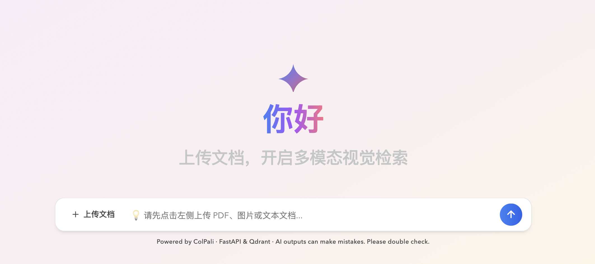

# VisionDoc

基于 **ColPali + MUVERA + Qdrant** 的多格式视觉文档问答系统。上传 PDF、图片或纯文本文件，系统将每页渲染为图像后用 ColPali 建立视觉索引，查询时两阶段检索召回最相关页面，再由豆包视觉大模型生成答案，并附上原页截图供溯源。

## 🌟 核心特性

- **多格式文件支持**：PDF / PNG / JPG / JPEG / WEBP / TXT / MD，统一渲染为页面图像进入索引
- **两阶段检索**：MUVERA 压缩向量快速海选（Prefetch）+ ColPali 原始多向量 MaxSim 精准重排（Rerank）
- **归一化相关性得分**：MaxSim 原始分除以查询 token 数，得分落在 0–1 区间，阈值稳定不受查询长度影响
- **多文档作用域查询**：Scope Bar 支持同时选中多个文档进行对话，也可切回全库检索
- **原页图片溯源**：每条回答附带匹配页面缩略图网格（最多 5 列自适应），点击大图查看；卡片显示文档名、页码与相关性得分
- **现代化 UI**：欢迎页 → 聊天页平滑过渡，暗色模式，Markdown 渲染，一键复制回答

## 🛠️ 技术栈

| 层次 | 技术 |
|---|---|
| 视觉嵌入模型 | ColPali v1.3（`vidore/colpali-v1.3`），128-D 多向量 |
| 加速检索 | MUVERA 16-D FDE（fastembed），Prefetch 倍率 5× |
| 向量数据库 | Qdrant（本地 Docker 或云端），MaxSim 比较器 |
| 大语言模型 | 豆包 Seed 2.0 Pro（`doubao-seed-2-0-pro-260215`），Volcengine ARK API |
| 后端框架 | FastAPI + uvicorn |
| 前端 | 原生 HTML/JS + Tailwind CSS CDN + marked.js |
| PDF 解析 | pdf2image + Poppler |
| 图像处理 | Pillow（图片缓存、文本渲染）|

## 📂 项目结构

```text
RAG/
├── requirements.txt
├── src/                           # AI 核心逻辑
│   ├── config.py                  # 环境变量（API Key、模型名、Qdrant URL 等）
│   ├── llm_generator.py           # 调用豆包视觉 LLM 生成答案
│   ├── doc_processor.py            # 多格式文档 → 页面图像缓存（PDF/图片/文本）
│   └── vector_store.py            # ColPali + MUVERA + Qdrant 封装
├── backend/                       # FastAPI 后端
│   ├── main.py                    # 应用入口，挂载静态前端
│   └── api/routes/
│       ├── health.py              # 健康检查
│       └── rag.py                 # 上传、对话、文件管理接口
└── frontend/                      # 前端客户端
    ├── index.html                 # 单页 HTML（Tailwind 样式）
    └── app.js                     # 所有交互逻辑
```

## 🚀 快速启动

### 1. 准备环境（推荐 Python 3.10+）

```bash
python3 -m venv .venv
source .venv/bin/activate
pip install -r requirements.txt
```

> macOS 需要安装 Poppler（PDF 解析依赖）：
> ```bash
> brew install poppler
> ```

### 2. 配置环境变量

在项目根目录创建 `.env` 文件（或直接在 `src/config.py` 中设置）：

```env
ARK_API_KEY=your_volcengine_ark_api_key
DOUBAO_MODEL_NAME=doubao-seed-2-0-pro-260215
QDRANT_URL=http://localhost:6333
COLLECTION_NAME=colpali-rag-collection
```

### 3. 启动 Qdrant

```bash
docker run -p 6333:6333 -p 6334:6334 \
    -v $(pwd)/qdrant_local:/qdrant/storage:z \
    qdrant/qdrant
```

### 4. 运行服务

```bash
python -m uvicorn backend.main:app --reload --port 8000
```

打开浏览器访问 [http://localhost:8000](http://localhost:8000)

## 📖 使用说明

1. **上传文件**：点击左侧上传按钮，支持 PDF、PNG、JPG、WEBP、TXT、MD 格式
2. **多文档管理**：点击右上角文件图标查看已加载文档，可下载原文件或删除
3. **作用域选择**：上传 2 个及以上文档后，输入框上方出现 Scope Bar，可点击选中特定文档进行对话
4. **提问**：在输入框输入问题，回车或点击发送；回答下方附有相关页面截图，点击可全屏查看

## 🔄 系统运行流程

### 1. 上传与建索引

1. 接收 PDF / 图片 / 文本文件
2. 将文档统一转换为页面图像
3. 使用 ColPali 为每一页生成多向量视觉特征
4. 使用 MUVERA 生成压缩向量，作为第一阶段快速召回特征
5. 将原始多向量与压缩向量一起写入 Qdrant

### 2. 对话与回答

1. 用户问题先经过轻量 guard，拦截明显与文档无关的闲聊 / 身份类问题
2. 对其余问题生成查询向量
3. 使用 MUVERA 在 Qdrant 中进行第一阶段 Prefetch
4. 用 ColPali 原始多向量执行 MaxSim 精排，得到最相关页面
5. 若有页面达到最小相关性阈值，则直接使用这些证据页生成答案
6. 若没有页面达到阈值，但仍检索到候选页，则硬回退到得分最高的 1 页证据继续生成答案
7. 将证据页截图与证据元数据送给豆包多模态模型生成答案

## 📏 证据质量分数说明

- 单页 `score`：Qdrant MaxSim 原始分除以 query token 数得到的归一化分数，目的是减弱查询长度对阈值的影响
- 顶部“证据质量”分数：当前已采用证据页中 top-3 分数的平均值，保留两位小数
- 这个分数是轻量相关性指标，不代表事实正确率；它更适合回答“当前回答依赖的证据页有多贴题”

## ⏱️ 性能与耗时说明

当前项目是多模态视觉 RAG，慢主要来自三类成本，而不是单一组件瓶颈：

1. **文档预处理**：PDF 转图、文本渲染成图，本身就有 IO 与图像处理开销
2. **视觉嵌入**：ColPali 要对每页图像做多向量推理，这是上传阶段最重的本地计算
3. **最终回答生成**：检索完成后还要调用豆包多模态模型生成答案，这通常比 Qdrant 查询更慢

项目当前已在日志中输出如下时序：

- 上传阶段：`document_render_ms`、`embedding_ms`、`point_build_ms`、`qdrant_upsert_ms`、`total_index_ms`
- 检索阶段：`query_embedding_ms`、`qdrant_query_ms`、`result_format_ms`、`total_retrieval_ms`
- 生成阶段：`first_token_ms`、`total_generation_ms`

如果面试官问“为什么慢，是不是电脑性能太弱”，更准确的回答是：

> 这是一个以视觉理解和可追溯性为优先目标的多模态 RAG 原型。上传时要做文档转图和视觉嵌入，问答时要做两阶段检索和外部多模态生成，所以整体链路天然比纯文本 RAG 更重。机器性能会影响体验，但真正的优化方向应该基于分段时序数据来判断，而不是直接把问题归因为电脑弱。

现实中的产品之所以通常不会让用户感到这么慢，核心不是只靠更强的机器，而是靠系统设计把重活拆开：

1. **异步索引**：上传后先秒回“任务已接收”，后台再做转图、嵌入和入库
2. **分层检索**：优先走更轻的文本索引或缓存命中，只有必要时才回退到更重的视觉检索
3. **更轻的在线模型**：先用更快的模型给出首答或首 token，再决定是否调用更重模型补全高保真答案
4. **缓存与预计算**：对热门文档、热门问题、文档文本层和页面特征做预热，尽量避免重复计算

所以，真实产品“感觉很快”的关键在于：用户不需要同步等待整条最重的视觉 RAG 链路跑完。

## ⚙️ 主要 API 接口

| 方法 | 路径 | 说明 |
|---|---|---|
| `POST` | `/api/rag/upload` | 上传并索引文件 |
| `POST` | `/api/rag/chat` | 发起对话查询 |
| `GET` | `/api/rag/files` | 列出所有已索引文档 |
| `GET` | `/api/rag/files/{id}/download` | 下载原始文件 |
| `DELETE` | `/api/rag/files/{id}` | 删除文档及其索引 |
| `GET` | `/api/health` | 服务健康检查 |
